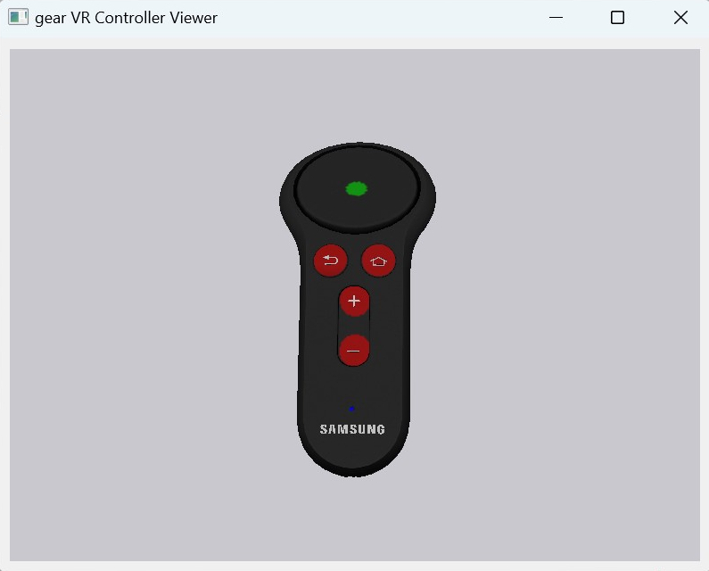

# gearVRC 

## Description
This is an implementation of a client for Samsung gear Virtual Reality Controller. It reads

- buttons
- touchpad
- accelerometer
- gyroscope
- magnetometer

and fuses that IMU data to a pose.

Included is a viewer that can subscribe to the client over the network and display
a realistic rendering of the the controller, including highlighting the user interactions
with the controller.

Instructions for the client: [gearVR Controller](./READMEclient.md)

Instructions for viewer: [gear VR Controller Viewer](./READMEviewer.md)

## Hardware
The Samsung gear Virtual Reality hardware is no longer produced but the controller can still be purchased on [Amazon](https://a.co/d/3ZQBLsD) and eBay. It is the least expensive controller that fits in your pocket. It features a track pad and IMU as well as several input buttons and in general is of high quality. It is a good device to control motors, robots or any other systems. It has a decent battery life, however it can not be recharged over USB.

## Pre Requisits
This software depends on several python packages:

- **bleak**: to communicate over BLE to controller
- **zmq**: communicates sensor data over the network 
- **msgpack**: serializes sensor data
- **numpy**: defines vectors and matrices
- **PyQT5**: renders widgets
- **OpenGL**: renders the 3D model
- **pywavefront**: loads the 3D model
- **pyglet**: loads the texture image
- **pyIMU**: provides sensor fusion framework (quaternion, AHRS, motion)
- **asyncio** to communicate withe sensor
- **pyserial_asyncio** to propvide senssor data on serial port
- **uvloop** (on Windows uvloop is not loaded) to speed up asyncio event loop.

## Calibration
For AHRS, calibration data is expected that ensures proper offset and scaling of the sensor measurements. These calibration data are specific for each sensor but one can also set offset to 0 and scales to 1 in the provided json files.

For calibration please check freeIMUCal in my repositories.
The magnetometer is unusable without calibration. If you just need the touchpad and input keys, no calibration is needed.

&copy; Urs Utzinger, 2023